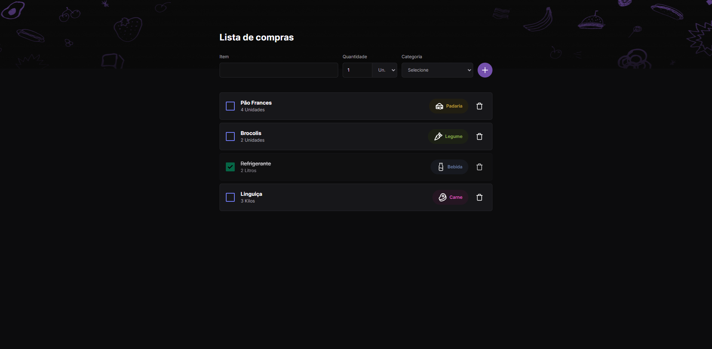

  <a href="#-Technologies">
Technologies</a>&nbsp;&nbsp;&nbsp;|&nbsp;&nbsp;&nbsp;
  <a href="#-Project">Project</a>

 

## 🚀 Technologies

This project was developed with the following technologies:

- Vue 3 (Composition API)
- TailwindCSS
- DaisyUI

## 🔖 Layout

The design was made by Rocketseat and you can see here:

- [Figma](https://www.figma.com/community/file/1276169043084346929/lista-de-compras-desafio-34)

## 💻 Project

